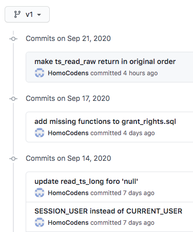
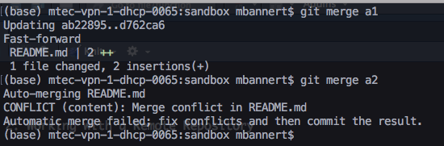
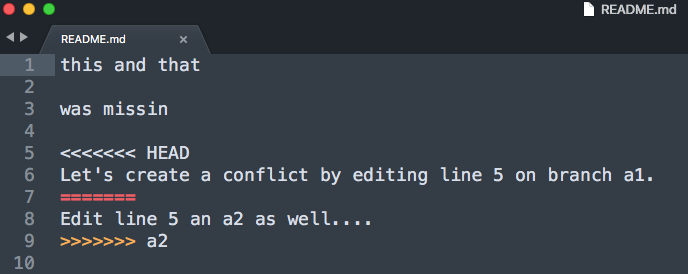
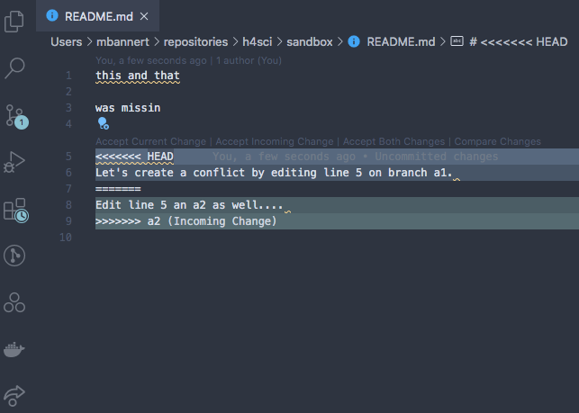

# Git Version Control

As stated before, version control may be the single most important thing to take away from *Hacking for Social Sciences*. 
In this chapter about the way developers work, I will stick to version control with *git*. The stack discussion of the previous chapter features a few more version control systems, but given git's dominant position, we will stick solely to git in this introduction to version control.  

## What is Git Version Control? 

Git is a decentralized version control system. It manages different versions of your source code (and other text files) in a simple but efficient manner that has become the industry standard: The git programm itself is a small console programm that creates and manages a hidden folder inside the folder you put under version control (you know those folders with a leading dot in their foldername, like .myfolder). This folder keeps track of all differences between the current version and other versions before the current one. 


<div class="caption-half">Meaningful commit messages help to make sense of a project's history.</div>


The key to appreciate the value of git is to appreciate the value of semantic versions. Git is *not* Dropbox nor Google Drive. It does *not* sync automagically (even if some Git GUI Tools suggest so). Because these GUIs tools^[[GitHub Desktop](https://desktop.github.com/), Atlassian's [Source Tree](https://www.sourcetreeapp.com/) and [Tortoise](https://tortoisegit.org/) are some of the most popular choices if you are not a console person.] may be convenient but do not really help to improve your understanding of the workflow, we will use the git console throughout this book. As opposed to the sync approaches mentioned above, a version control system allows to summarize a contribution across files and folders based on what this contribution is about. Assume you got a cool pointer from an econometrics professor at a conference and you incorporated her advice in your work. That advice is likely to affect different parts of your work: your text and your code. As opposed to syncing each of these files based on the time you saved them, version control creates a version when you decide to bundle things together and to commit the change. That version could be identified easily by its commit message 'incorporated advice from Anna (discussion at XYZ Conf 2020)'. 


## Why Use Version Control in Research? 

>A version control based workflow is a path to your goals that rather consists of semantically relevant steps instead of semantically meaningless chunks based on the time you saved them. 

In other more blatant, applied words: naming files like 
`final_version_your_name.R` or `final_final_correction_collaboratorX_20200114.R` 
is like naming your WiFi `dont_park_the_car_in_the_frontyard` or `be_quiet_at_night` to communicate with your neighbors.  Information is supposed to be sent in a message, not a file name. With version control it is immediately clear what the most current version is - no matter the file name. No room for interpretation. No need to start guessing about the delta between the current version and another version.

Also, you can easily try out different scenarios on different branches and merge them back together if you need to. Version control is a well established industry standard in software development. And it is relatively easy to adopt. With datasets growing in size and complexity, it is only natural to improve management of the code that processes these data. 

Academia has probably been the only place that would allow you to dive into hacking at somewhat complex problems for several years w/o ever taking notice of version control. As a social scientist who rather collaborates in small groups and writes moderate amount of code, have you ever thought about how to collaborate with 100+ persons in a big software project? Or to manage ten thousands of lines of code and beyond? Version control is an important reason why these things work. And it's been around for decades. But enough about the rant... 


## How Does Git Work ? 


>This introduction tries narrow things down to the commands that you'll need if want to use git in similar fashion to what you learn from this book. If you are looking for more comprehensive, general guides, three major git platforms, namely Atlassian's Bitbucket, GitHub and Gitlab offer comprehensive introductions as well as advanced articles or videos to learn git online.


The first important implication of decentralized version control is that all versions are stored on the local machines of every collaborator, not just on a remote server (this is also a nice, natural backup of your work). So let's consider a single local machine first.


<div class="caption-half"></div>

Locally, a git repository consists of a *checkout* which is also called current *working copy* soon. This is the status of the file that your file explorer or your editor will see when you use them to open a file. To checkout a different version, one needs to call a commit by its unique commit hash and checkout that particular version. 

If you want to add new files to version control or bundle changes to some existing files into a new commit, add these files to the staging area, so they get committed next time a commit process is triggered. Finally committing all these staged changes under another commit id a new version is created. 


## Moving Around

So let's actually do it. Here's a three stage walk through of git commands that should have you covered in most use cases a researcher will face. Note that git has some pretty good error message that guess what could have gone wrong. Make sure to read them carefully. Even if you can't make sense of them, your online search will be a lot more efficient when you include these messages. 

**Stage 1: Working Locally**

```{r gittable, eval=TRUE,message=FALSE, echo=FALSE}
library(kableExtra)
d <- data.frame("Command" = c("git init",
                              "git status",
                              "git add file_name.py",
                              "git commit -m 'meaningful msg'",
                              "git log",
                              "git checkout some-commit-id",
                              "git checkout main-branch-name"),
                "Effect" = c("put current directory and all its subdirs under version control.",
                             "shows status",
                             "adds file to tracked files",
                             "creates a new version/commit out of all staged files",
                             "show log of all commit messages on a branch",
                             "go to commit, but in detached HEAD state",
                             "leave temporary state, go back to last commit"),
                
                stringsAsFactors = FALSE)
kable(d,"html",escape= FALSE)

```


**Stage 2: Working with a Remote Repository**

Though git can be tremendously useful even without collaborators, the real fun starts
when working together. The first step en route to get others involved is to add a remote repository. 


```{r gittable2, eval=TRUE,message=FALSE, echo=FALSE}
library(kableExtra)
d <- data.frame("Command" = c("git clone",
                              "git pull",
                              "git push",
                              "git fetch",
                              "git remote -v",
                              "git remote set-url origin https://some-url.com"),
                "Effect" = c("creates a new repo based on a remote one",
                             "get all changes from a linked remote repo",
                             "deploy all commit changes to the remote repo",
                             "fetch branches that were created on remote",
                             "show remote repo URL",
                             "set URL to remote repo"),
                stringsAsFactors = FALSE)
kable(d,"html",escape= FALSE)

```

**Stage 3: Branches**

Branches are derivatives from the main branch that allow to work on different feature at the same time
without stepping on someone elses feet. Through branch repositories can actively maintain different states. 


```{r, eval=TRUE,message=FALSE, echo=FALSE}
library(kableExtra)
d <- data.frame("Command" = c("git checkout -b branchname",
                              "git branch",
                              "git checkout branchname",
                              "git merge branchname"),
                "Effect" = c("create new branch named branchname",
                             "show locally available branches",
                             "switch to branch named branchname",
                             "merge branch named branchname into current branch"
                ),
                stringsAsFactors = FALSE)
kable(d,"html",escape= FALSE)

```


**Fixing Merge Conflicts** 

In most cases *git* is quite clever and can figure out which is the desired state of 
a file when putting two versions of it together. When git's *recursive strategy* is possible, git
it wil merge versions automatically. When the same lines were affected in different versions, git cannot tell 
which line should be kept. Sometimes you would even want to keep both changes. 

But even in such scenario fixing the conflict is easy. Git will tell you that your last command
caused a merge conflict and which files are conflicted. Open these files and see all parts of the file that
are in question. 


<div class="caption-left">Ouch! We created a conflict by editing the same line in the same file on different branches and trying to but these branches back together.</div>

Luckily git marks the exact spot where the conflict happens. Good text editors / IDEs 
ship with cool colors to highlight all our options. 


<div class="caption-left">go for the current status or take what's coming in from the a2 branch?</div>

Some of the fancier editors even have git conflict resolve plugins that let you walk through all conflict points. 


<div class="caption-left">In VS Code you can even click the option.</div>

At the and of the day, all do the same, i.e., remove the unwanted part including all the marker gibberish. 
After you have done so, save, commit and push (if you are working with a remote repo) . Don't forget to make sure you kinked out ALL conflicts.  


## Collaboration Workflow


### Feature Branches

This section discusses real world collaboration workflows of modern open source software developers. 
Hence the prerequisites are a bit different in order to benefit the most from this section. Make sure you are past
being able to describe and explain git basics, be able to create and handle your own repositories. 

If you had only a handful of close collaborators so far, you may be fine with staying on the main branch and trying
not to step on each others feet. This is reasonable because it is not useful to work asynchronously 
on exact the same lines of code anyway. Nevertheless, there is a reason why *feature-branch-based* workflows became 
very popular among developers: Imagine you collaborate less synchronously, maybe with someone in another timezone. Or with a colleague who works on your project, but in a totally different month during the year. Or, most obviously, we someone you have never met. Forks and *feature-branch-based* workflows is the way a lot of modern open source projects are organized. 

Forks are just a way to contribute via feature branches even in case you do not have write access to a repository. But let's just have look at the basic case in which you are part of the team first. Assume there is already some work done, some version of the project is already up on GitHub. You join as a collaborator and are allowed to push changes now. It's certainly not a good idea to simply add things without review to a project's production. Like if you got access to modify the institute's website and you made your first changes and all of a sudden the website looks like this:

<div class="yellow">&nbsp;</div>
<div id="pink">
It used to be subtle and light gray. I swear!
</div>

Bet everybody on the team took notice of the new team member by then. In a feature branch workflow you would start from the latest production version. Remember, git is decentralized and you have all versions of your team's project. Right at your fingertips on your local machine. Create a new branch named indicative of the feature you are looking to work on. 

```
git checkout -b colorways
```

You are automatically being switched to the freshly created branch. Do your thing now. It could be just a single commit, or several commits by different persons. Once you are done, i.e., commited all changes, add your branch to the remote repository by pushing.  

```
git push -u origin colorways
```

This will add a your branch called *colorways* to the remote repository. If you are on any major git platform with your project, it will come with a decent web GUI. Such a GUI is the most straight forward way to do the next step: get your Pull Request (PR) going.


<div class="caption-left">Github pull request dialog: Select the *pull request*, choose which branch you merge into which target branch.</div>

As you can see, git will check whether it is possible to merge automatically w/o interaction. Even if that is not possible, you can still issue the pull request. When you create the request you can also assign reviewers, but you could also do so at a later stage. 

```{block, type='note'}

**Note**, even after a PR was issued you can continue to add commits to the branch about to be merged. 
As long as you do not merge the branch through the Pull Request, commits are added to the branch. In other 
words your existing PR gets updated. This is a very natural way to account for reviewer comments. 

```


```{block2, type='note'}
**Pro-Tipp**: 
Use commit messages like 'added join to SQL query, closes #3'. The key word 'closes' or 'fixes', will automatically close issues referred to when merged into the main branch.

```

Once the merge is done, all your changes are in the main branch and you and everyone else can pull the main branch that now contains your new feature. Yay!


### PRs and Forks

