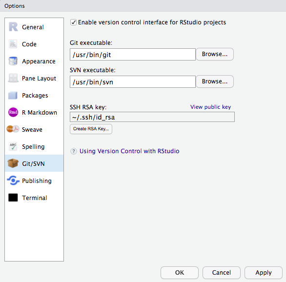
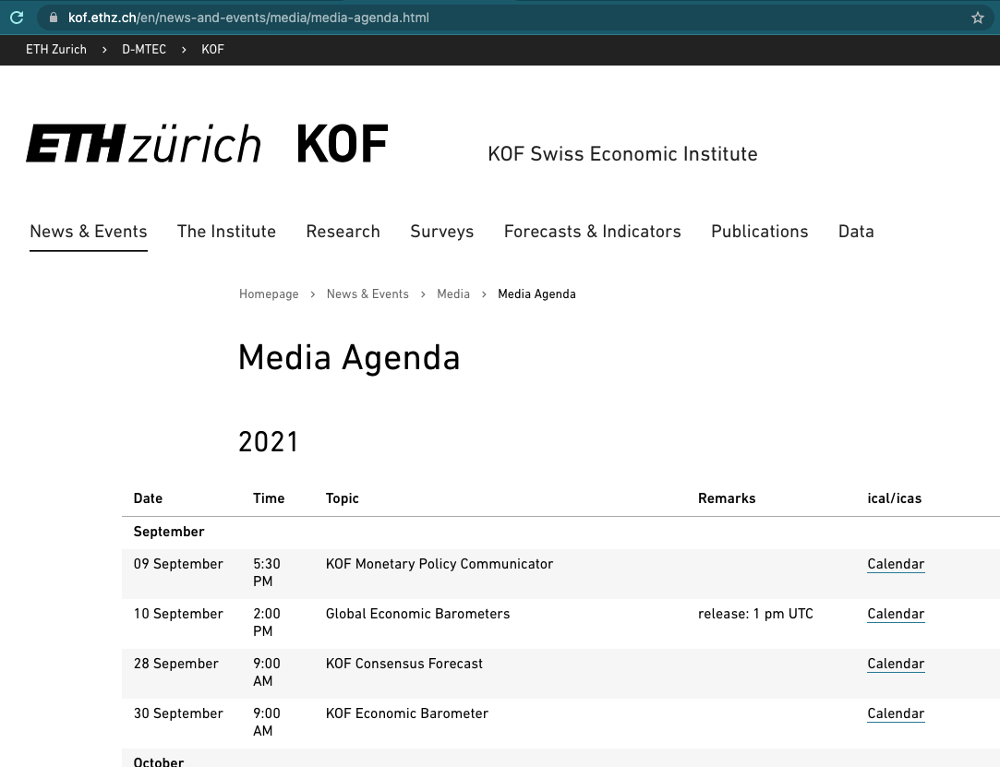
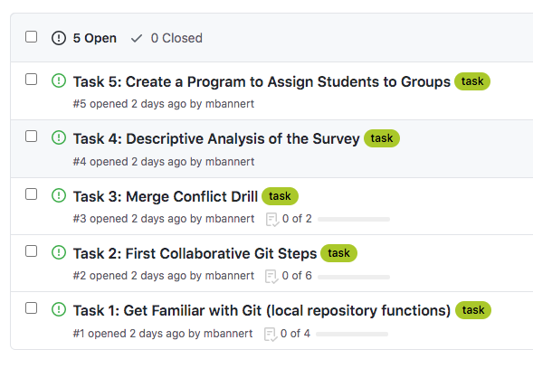
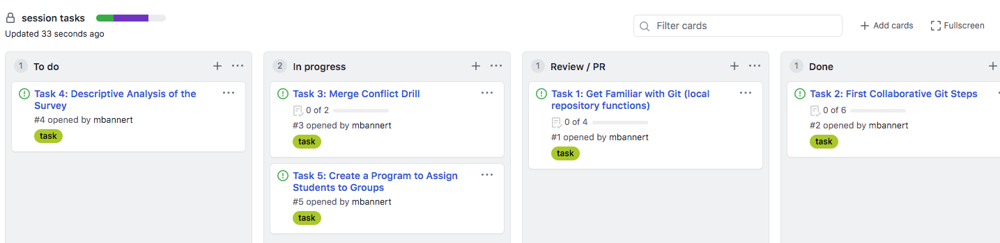

# Case Studies

While the rest of the book provided more of a big picture type of insight, this section is all about application minded examples that most of the time feature code to reproduce. 

## RSA Key Pair Authentication

This section could be headed 'log in like a developer'. RSA Key Pairs are a convenient, relatively secure way to log into an account. SSH based connections, including secure copy (SCP), often make use of RSA Key Pairs instead of using a combination of username and password. Also, most git platforms use this form of authentication. The basic idea of key pairs is to have a public key and a private key. While the private key is never shared with anyone, the public key is shared with any server you want to log in to.
It's like getting a custom door for any house that you are allowed to enter: share your public key with the server admin / or web portal and you'll be allowed in when you show your private key. In case you loose your private key or suspect it has been stolen, simply inform the admin, so she can remove the door (the public key). This is were a little detail comes into play: 
you can password protect the authentication process. Doing so buys you time to remove the key from the server before your password gets bruteforced. The downside of this additional password is its need for interaction. So when you are setting up a batch that talks to a remote server that is when you do *not* want a key /w password. 

Step one en route to log in like a grown up, is the create an RSA key pair. Github has a [1-2-3 type of manual](https://docs.github.com/en/free-pro-team@latest/github/authenticating-to-github/generating-a-new-ssh-key-and-adding-it-to-the-ssh-agent) to get it done. Nevertheless, I would like the R Studio (Server) specific way here. 

1. Login to https://teaching.kof.ethz.ch/ (or use your local R Studio Desktop)
2. Go to *Tools* -> *Global Options* -> *Git/SVN*
3. Hit Create RSA KEY (When you some crazy ASCII art reminiscant of a rabbit, it's just ok.)
4. Click 'View Public Key' 
5. Copy this key to the your clipboard. 


<div class="caption-left">The R Studio GUI is an easy way to create an RSA Key Pair.</div> 

6. You can paste the key you obtained to your Github settings or put it into your server's authorized keys file. 

Congrats you may log in now! 


## Consuming APIs 

An Application Programming Interface (API) is nothing else but an interface to facilitate machine to machine communication. An interface can be anything, any protocol or pre-defined process. But of course there are standard and not-so-standard ways to communicate. Plus some matter-of-taste type of decisions. But security and standard compliance are none of the latter. 
There are standards such as the popular, URL based REST that make developers'
lives a lot easier -- regardless of the language they prefer. 

Many services such as Google Cloud, AWS, your university library, your favorite social media platform or your local metro operator provide an API. Often either the platform itself or the community provide what's called an API wrapper: 
A simple program wraps the process of using the interface though dynamic URLs into a parameterized function. Because the hard work is done serverside by the API backend, building API wrappers is fairly easy and if you're lucky wrappers for your favorite languages exit already. If that is the case end users can simply use functions like `get_dataset(dataset_id)` to download data programatically. 


### Example 1: The {kofdata} R package

The KOF Swiss Economic Institute at ETH Zurich provides such a wrapper in an R package. The underlying API allows to access the KOF time series archive database and obtain data and meta information alike. The below code snippet gets data from the API and uses another KOF built library ({tstools}) to visualize the returned time series. 


```{r, warning=FALSE, message=FALSE}
library(kofdata)
# just for viz
library(tstools)
tsl <- get_time_series("ch.kof.barometer")
tsplot(tsl)

```


### Example 2: The {OECD} R package 

Also large organizations like the Organization for Economic Co-operation and development (OECD) provide API wrappers to facilitate data consumption. 

### Build Your Own API Wrapper

Here's an example of a very simple API wrapper that makes use of the 
Metropolitan Museum of Modern Art's API to obtain identifiers of pictures based on 
a simple search. 

```{r, eval=FALSE, warning=FALSE,message=FALSE}
# Visit this example query
# https://collectionapi.metmuseum.org/public/collection/v1/search?q=umbrella
# returns a json containing quite a few ids of pictures that were tagged 'umbrella'

#' Search MET
#'
#' This function searches the MET's archive for keywords and
#' returns object ids of search hits. It is a simple wrapper
#' around the MET's Application Programming interface (API).
#' The function is designed to work with other API wrappers
#' and use object ids as an input.
#' @param character search term
#' @return list containing the totoal number of objects found
#' and a vector of object ids.
#'
# Note these declaration are not relevant when code is not
# part of a package, hence you need to call library(jsonlite)
# in order to make this function work if you are not building
# a package.
#' @examples
#' search_met("umbrella")
#' @importFrom jsonlite formJSON
#' @export
search_met <- function(keyword){
  # note how URLencode improves this function
  # because spaces are common in searches
  # but are not allowed in URLs
  url <- sprintf("https://collectionapi.metmuseum.org/public/collection/v1/search?q=%s", URLencode(keyword))
  fromJSON(url)
}

```

You can use these ids with another [endpoint]() in order to receive the pictures
themselves.

```{r, eval=FALSE,warning=FALSE,message=FALSE}
download_met_images_by_id <- function(ids,
                                      download = "primaryImage") {
  # Obtain meta description objects from MET API
  obj_list <- lapply(ids, function(x) {
    req <- download.file(sprintf("https://collectionapi.metmuseum.org/public/collection/v1/objects/%d",
                   x),destfile = "temp.json")
    fromJSON("temp.json")
  })

  # Extract the list elements that contains
  # img URLs in order to pass it to the download function
  img_urls <- lapply(obj_list, "[[", download)
  # Note the implicit return, no return statement needed
  # last un-assigned statement is returned from the function
  lapply(seq_along(img_urls), function(x) {
    download.file(img_urls[[x]],
                  destfile = sprintf("data/image_%d.jpg", x)
    )
  })
}


# Step 4: Use the Wrapper
umbrella_ids <- search_met("umbrella")
umbrella_ids
download_met_images_by_id(umbrella_ids$objectIDs[2:4])
```


## Create Your Own API

Being able to expose data is a go-to skill in order to make research reproducible and credible. Especially when data get complex and require thorough description in order to remain reproducible for others, a programmtic, machine readable approach is the way to go. 


### GitHub to Serve Static Files

Exposing your data through an API is not something you would need a software engineer or an own server infrastructure for. Simply hosting a bunch of .csv spreadsheet alongside a good description (in separate files!!) on, e.g., GitHub for free can be an easy highly available solution to serve static files. 

The KOF High Frequency Economic Monitoring dashboard simply shares standardized .csv (data) and .json (description) files based on a Github. 


INSERT SCREENSHOT OF GITHUB HERE

To make it look at little niftier, the dashboard uses a quasar frontend to guide the human user, but it would not be necessary to have such a framework.

INSERT SCREENSHOT OF KOFDATA HERE


### Simple Dynamic APIs

Even going past serving static files, does not require much software development expertise. 
Thanks to frameworks such as express.js or the {plumbr} it easy to create an API that turns a URL into a server side action and returns a result. 

Assume you've installed node.js already, you can set up a simple API on your local computer just like this. 

```
# run initialization in a dedicated folder
mkdir api
cd api
npm init
```

just sleep walk through the interactive dialog accepting all defaults. Once done, add install express using the npm package manager.

```
npm install express --save
```


## A Minimal Webscraper: Extracting Publication Dates

Even though KOF Swiss Economic Institute offers a REST API to consume publicly available data, publication dates are unfortunately not available through in API just yet. Hence, in order to automate data consumption based on varying publication dates, we need to extract upcoming publication dates of the Barometer from KOF's media release calendar. Fortunately all future releases are presented online an easy-to-scrape table. So here's the plan: 

1. Use Google Chrome's *inspect element* developer feature to find the X-Path (location in the Document Object Model) of the table. 

2. Read the web page into R using `rvest`.

3. Copy the X-Path string to R to turn the table into a data.frame

4. use a regular expression to filter the description for what we need. 


Let's take a look at our starting point, the media releases sub page, first. 



The website looks fairly simple and the jackpot is not hard, presented in a table 
right in front of us. Can't you smell the data.frame already? 

Right click the table to see a Chrome context window pop up. Select *inspect*. 


Hover over the blue line in the source code at the bottom. Make sure the selected line marks the table. Right click again,
select copy -> copy X-Path. 


On to R! 

```{r, warning=FALSE,message=FALSE}
library(rvest)
# URL of the media release subsite
url <- "https://kof.ethz.ch/news-und-veranstaltungen/medien/medienagenda.html"

# Extract the DOM object from the path we've previously detected using 
# Chrome's inspect feature
table_list <- url %>%
  read_html() %>%
  html_nodes(xpath = '//*[@id="contentMain"]/div[2]/div/div[3]/div/div/div/div/div/div/table') %>%
  # turn the HTML table into an R data.frame
  html_table()

# because the above result may potentially contain multiple tables, we just use 
# the first table. We know from visual inspection of the site that this is the
# right table. 
agenda_table <- table_list[[1]]

# extract KOF barometer lines
pub_date <- agenda_table[grep("barometer",agenda_table$X3),]
pub_date

```

Yay! We got everything we wanted. Ready to process. 


## Automate Script Execution: A GitHub Actions Example 


## Choropleth Map: Link Data to a geojson Map File

Data visualization is a big reason for researchers and data analysts to look into programming languages. Programming languages do not only provide unparalleled flexibility, they also make data visualization reproducible and allow to place charts in different contexts, e.g., websites, printed outlets or social media. 

One of the more popular type of plots that can be created smoothly using a programing language is the so called *choropleth*. A *choropleth* maps values of a variable that is available by region to a given continuous color palette on a map. Let's break down the ingredients of the below map of Switzerland. 

```{r, echo=FALSE}
library(echarts4r)
library(viridisLite)
library(jsonlite)

json_ch <- jsonlite::read_json(
  "https://raw.githubusercontent.com/mbannert/maps/master/ch_bfs_regions.geojson"
)


d <- data.frame(
  name = c("Zürich",
           "Ticino",
           "Zentralschweiz",
           "Nordwestschweiz",
           "Espace Mittelland",
           "Région lémanique",
           "Ostschweiz"),
  values = c(50,10,100,50,23,100,120)
)

d |>
  e_charts(name) |>
  e_map_register("CH", json_ch) |>
  e_map(serie = values, map = "CH") |>
  e_visual_map(values,
               inRange = list(color = viridis(3)))

```

First, we need a *definition of a country's shape*. Those definitions come in various format from traditional *shape files* to web friendly *geoJSON*. Edzer Pebesma's [useR! 2021 keynote](https://www.youtube.com/watch?v=cK08bxUJn5A&list=PL4IzsxWztPdmHoJwIVa4um44w2GMjctmP&index=6) has a more thorough insight. 

Second, we need some data.frame that simply connects values to regions. In this case we use regions defined by the Swiss Federal Statistical Office (FSO). Because our charting library makes use of the geoJSON convention to call the region label 'name' we need to call the column that holds the region names 
'name' as well. That way we can safely use defaults when plotting. Ah, and note that the values are absolutely bogus that came to my mind while writing this (so please do not mull over how these values were picked).

```{r, eval=FALSE}

d <- data.frame(
  name = c("Zürich",
           "Ticino",
           "Zentralschweiz",
           "Nordwestschweiz",
           "Espace Mittelland",
           "Région lémanique",
           "Ostschweiz"),
  values = c(50,10,100,50,23,100,120)
)


```

Last but not least where calling our charting function from the *echarts4r* package. *echarts4r* is an R wrapper for the feature rich Apache Echarts Javascript plotting library. 
The example uses the base R pipes (available from 4+ on, former versions needed to use pipes via extension packages.). Pipes take the result of one previous line and feed it as  input into the next line. So the data.frame *d* is linked to a charts instance and the *name* column is used as the link. Then a map is registered as *CH* and previously read json content is used to describe the shape. 

```{r, eval=FALSE}
d |>
  e_charts(name) |>
  e_map_register("CH", json_ch) |>
  e_map(serie = values, map = "CH") |>
  e_visual_map(values,
               inRange = list(color = viridis(3)))
```

Also note the use of the viridis functions which returns 3 values from the famous, colorblind friendly viridis color palette. 

```{r}
viridis(3)
```

Here's the full example: 

```{r,eval=FALSE}
library(echarts4r)
library(viridisLite)
library(jsonlite)

json_ch <- jsonlite::read_json(
  "https://raw.githubusercontent.com/mbannert/maps/master/ch_bfs_regions.geojson"
)


d <- data.frame(
  name = c("Zürich",
           "Ticino",
           "Zentralschweiz",
           "Nordwestschweiz",
           "Espace Mittelland",
           "Région lémanique",
           "Ostschweiz"),
  values = c(50,10,100,50,23,100,120)
)

d |>
  e_charts(name) |>
  e_map_register("CH", json_ch) |>
  e_map(serie = values, map = "CH") |>
  e_visual_map(values,
               inRange = list(color = viridis(3)))

```


## Web Applications /w R Shiny 

For starters, let me de-mistify {shiny}. There are basically two reasons why so many inside data science and analytics have shiny on their bucket list of things to learn. First, it gives researchers and analysts home court advantage on a webserver. Second, it gives our online appearances a kickstart in the dressing room.  

Don't be surprised though if your web development professional friend outside data science and analytics never heard of it. Compared to web frontend framework juggernauts such as *react*, *angular* or *vue.js* the shiny web application framework for R is rather a niche ecosystem. 

Inside the data science and analytics communities, fancy dashboards and the promise of an easy, low hurdle way to create nifty interactive visualizations have made {shiny} app development a sought after skill. Thanks to pioneers, developers and teachers like Dean Attali, John Coene, David Granjon, Colin Fay and Hadley Wickham, the sky seems the limit for R shiny applications nowadays.

This case study does not intend to rewrite {shiny}'s great documentation or blogs and books around it. I'd rather intend to help you get your first app running asap and explain a few basics along the way. 

### The Web Frontend 


Stats & figures put together by academic researchers or business analysts are not used to spend a lot of time in front of the mirror. (Often for the same reason as their creators: perceived opportunity costs.)

Shiny bundles years worth of lime light experience and online catwalk professionalism into an R package. Doing so allows us to use all this design expertise through an R interface abstracting away the need to dig deep into web programming and frontend design (you know the HTML/CSS/Javascript).

Let's consider the following web frontend put together with 
a few lines of R code. Consider the following, simple web fronted that lives in a dedicated user interface R file, called *ui.R*:


```{r, eval=FALSE}
library(shiny)
library(shinydashboard)

dashboardPage(
  dashboardHeader(title = "Empty App"),
  dashboardSidebar(),
  dashboardBody(
    fluidPage(
      fluidRow(
        box(title = "Configuration",
            sliderInput("nobs",
                        "Number of Observations",
                        min = 100,
                        max = 10000,
                        value = 500),
            sliderInput("mean_in","Mean",
                        min = 0,
                        max = 10,
                        value = 0),
            sliderInput("sd_in","SD",
                        min = 1,
                        max = 5,
                        value = 1),
            width = 4),
        box(title = "Distribution",
            plotOutput("dist"),
            width = 8)
      ),
      fluidRow(
        box("Tabelle",
            dataTableOutput("tab"),
            width=12
            )
      )
    )
    
  )
)


```

Besides the shiny package itself, the ecosystem around shiny brings popular frontend frameworks from the world outside data science to R. In the above case, a boilerplate library for dashboards is made available through the add-on package {shinydashboard}.

Take a moment to consider what we get readily available at our finger tips: Pleasant user experience (UX) comes from many things. Fonts, readability, the ability to adapt to different screens and devices (responsiveness), a clean, intuitive design and many other aspects. {shinydashboard} adds components like *fluidPages* or *fluidRow* to implement a responsive (google me), grid based design using R.
Note also how similar the hierarchical, nested structure of the above code is to HTML tagging. (Here's some unrelated minimal HTML)


```html
<!-- < > denotes an opening, </ > denotes an end tag. -->
<html>
  <body>
  <!-- anything in between tags is affected by the tags formatting.
       In this case bold -->
    <b> some bold title </b>
    <p>some text</p>
  </body>
</html>


```

{shiny} ships with many widgets^[online widget galleries like R Studio's [shiny widget gallery](https://shiny.rstudio.com/gallery/widget-gallery.html) that help to 'shop' for the right widgets.] such as input sliders or table outputs that can simply be placed somewhere on your site. Again, add-on packages provide more widgets and components beyond those that ship with shiny. 


### Backend

While the frontend is mostly busy looking good, the backend has to do all the hard work, the computing, the querying -- whatever is processed in the background based on user input. 


Under-the-hood-work that is traditionally implemented in languages like Java, Python or PHP^[Yup, there is node and javascript on web servers, too, but let's keep things simple and label javascript clientside here. And yes, shiny server used to require node itself, too.] can now be done in R. This is not only convenient for the R developer who does not need to learn Java, it's also incredibly comfy if you got data work to do. Or put differently: who would like to implement logistic regression, random forests or principal component analysis in PHP?


Consider the following minimal backend *server.R* file which corresponds to the above *ui.R* frontend file. The anonymous (nameless) function which is passed on to the *ShinyServer* function takes two named lists, *input* and *output*, as arguments. The named elements of the input list correspond to the *widgetId* parameter of the UI element. 
In the below example, our well known base R function *rnorm* takes *nobs* from the input as its *n* sample size argument. Mean and standard deviation are set in the same fashion using the user interface (UI) inputs. 

```{r, eval=FALSE}

library(shiny)

shinyServer(function(input,output){
  
  output$dist <- renderPlot({
    hist(
      rnorm(input$nobs,
            mean = input$mean_in,
            sd = input$sd_in),
      main = "",
      xlab = ""
      )
  })
  
  output$tab <- renderDataTable({
    mtcars
  })
  
  
  
})


```

The vector that is returned from *rnorm* is passed on to the base R *hist* which returns a histogram plot. This plot is then rendered and stored into an element of the *output* list. The *dist* name is arbitrary but again matched to the UI. The *plotOutput* function of *ui.R* puts the rendered plot onto the canvas so it's on display in people's browsers. *renderDataTable* does so in analog fashion to render and display the data table.    


### Put Things Together and Run Your App 


The basic app shown above consists of a *ui.R* and a *server.R* file living in the same folder. The most straight forward way to run such an app is to call the *runApp()* function and provide the location of the folder that contains both of the aforementioned files. 

```{r, eval=FALSE}
library(shiny)
runApp("folder/that/holds/ui_n_server")
```

This will use your machine's built-in web server and run shiny locally on your notebook or desktop computer. Even if you never put your app on a web server and run a website with it this is already a legitimate way 
to distribute your app. If it was part of an R package, everyone who download your package could use it locally, maybe as a visual inspection tool or way to derive inputs interactively and feed them into your R calculation. 


### Serve your App

Truth be told, the full hype and excitement of a shiny app only comes into play when you publish your app and make it available to anyone with a browser, not just the R people. Though hosting is a challenge in itself let me provide you a quick shiny specific discussion here. The most popular options to host a shiny app are 

- **software-as-a-service (SaaS)**. No maintenance, hassle free, but least bang-for-buck. The fastest way to hit the ground running is R Studio's service *shinyapps.io*.  

- **on premise aka in house**. Either download the open source version of shiny server, the alternative shiny proxy or the R Studio Connect premium solution and install them on your own Virtual machine. 

- use a **shiny server docker image** and run a container in your preferred environment. 


### Shiny Resources

One of the cool things of learning shiny is how shiny and its ecosystem allow you to learn quickly. Here are some of my favorite resources to hone your shiny skills. 


- [R Studio Shiny's Widget Gallery](https://shiny.rstudio.com/gallery/widget-gallery.html) 

- [shinydashboard](https://rstudio.github.io/shinydashboard/)

- [Mastering Shiny by Hadley Wickham](https://mastering-shiny.org/)

- [Engineering Production Grade Shiny Apps](https://engineering-shiny.org/)

- [RInterface by David Granjon, John Coene, Victor Perrier and Isabelle Rudolf](https://rinterface.com/)


## Project Management Basics

The art of stress free productivity as I once called it in '10 blog post, has put a number of gurus on the map and whole strand of literature to our bookshelves. So rather than adding to that, I would like to extract a healthy, best-of-breed type of dose here. The following few paragraphs do not intend to be comprehensive -- not even for the scope of software projects, but inspirational. 

In tje software development startup community, the *waterfall* approach became synonym to conservative, traditional and ancient: Overspecification in advance of the project, premature optimization and a lawsuit over expectations that weren't met. Though waterfall project may be better than their reputation and specifications should not be too detailed and rigid.

Many software projects are rather organized in *agile* fashion with SCRUM and KANBAN being the most popular derivatives. 
Because empirical academic projects have a lot in common with software projects inasmuch that there is a certain expectation and quality control, but the outcome is not known in advance. Essentially in agile project management you roughly define an outcome along the lines of a minimum viable product (MVP). That way you do not end up with nothing after a year of back and forth. 
During the implementation you'd meet regularly, let's say every 10 days, to discuss development since the last meet and what short term plans for the next steps ahead. The team picks splits work into task items on the issue tracker and assigns them.  Solution to problems will only be sketched out and discussed bilaterally or in small groups. By defining the work package for only a short timespan, the team stays flexible. In professional setups agile development is often strictly implemented and makes use of sophisticated systems of roles that developers and project managers can get certified for. 

Major git platforms ship with a decent, carpentry level project management project management GUI. The issue tracker is at the core of this. If you use it the minimal way, it's simply a colorful to-do list. Yet, with a bit of inspiration and use of tags, comments and projects, an issue tracker can be a lot more


<div class="caption-left">The Github issue tracker (example from one of the course's repositories) can be a lot more than a todo list.</div>

Swimlanes (reminiscant of a bird's eye view of an Olympic pool) can be thought of columns that you have to walk through
from left to right: To Do, Doing, Under Review, Done. (you can also customize the number and label of lanes and event associate actions with them, but let's stick to those basic lanes in this section.) The idea is to use to keep track of the process and making the process transparent. 



<div class="caption-left">GitHub's web platform offers swimlanes to keep a better overview of issues being worked on.</div>

```{, type='note'}
**Tipp**: 
No lane except 'Done' should contain more than 5-6 issues. 
Doing so prevents clogging the lanes at particular stage which 
could potentially lead to negligent behavior, e.g., careless reviews. 

```


<!--
## Articles, Presentations, Reports and Websites /w Markdown and RMarkdown

Working with data asks for reproducible reports, presentations and articles that can be rendered to accessible, screenreader friendly online output as well as more traditional, print minded PDF output. 
This case study explains how to create documents like this book, a presentation for a conference or simple, static reporting minded websites.

*Markdown* is simple language based approach that can handle all of these tasks and allows for automation at the same time. Automation of document rendering does not only save time, it also ensures reproducibility across different machines. The name *Markdown* is a wordplay as *Markdown* is a simple mark-up language, similar to HTML or LaTeX but with a much much simpler syntax. 
*Markdown* helps users to format plain text using reserved characters. For example, a set of ** at the beginning and at the end of a word, sentence or paragraph lets everything wrapped in between these double asterisk appear **bold**, wrapping text in a single * asterisk makes the wrapped text *italic*. *Markdown* has become so ubiquitous that websites such as GitHub, discussion boards or Q&A sites allow users who post online to use *Markdown* to format their text. 

Various rendering engines can render *Markdown* into HTML, PDF or even MS Word output. Often [pandoc](https://pandoc.org/) is a popular driver as a universal document converter under the hood. Programming languages such as Python and R have embraced *Markdown* based reporting to mingle descriptive plain text with code in order to execute the code at render time and fit tables, figures and even animations into reports. [Jupyter notebooks](https://jupyter.org/) is an interactive Python based example. In the R ecosystem the approach is slightly different and is called *knitting* which is why the corresponding package is called [knitr](https://yihui.org/knitr/). In the meantinem there is a plethora of packages (with great documentation that I won't c&p here but refer to) for different flavors of output: {[bookdown]()} for online books such as this one, {[pkgdown]()} for documenting your own R package or {[blogdown]()} to run your own markdown based blog (hosted for free on, e.g., GitHub). In addition to these "main diagonal" packages, there smaller gems such as the {[postcard]()} package to get a mini personal website up in a few minutes. 

- [*Markdown* source of this particular site that you are reading here]().
- [*Markdown* source of a presentation slides]()


## Spatial Visualization with Leaflet and Open Streetmap


## Basic Parallel Programming

Here's an R example using the {microbenchmark} package to check the effect parallel computing on running seasonal adjustment of multiple time series. First let's set up some demo data: We simply create a list with 1000 elements each of which is the same
monthly time series about airline passengers from 1949-1960. 

```{r}
data("AirPassengers")
tsl <- list()
for(i in 1:1000){
  tsl[[i]] <- AirPassengers
}
```

Now, let's load the {seasonal} package and perform a basic seasonal adjustment
of each of these time series. The first statement performs 1000 adjustments 
sequentially, the second statement uses parallel computing to spread computations across my machines multiple processors. The key take away from this exercise is not the parallel computation itself, but the ability to set up a benchmark. 

```{r}
library(seasonal)
library(microbenchmark)


```

Obviously the absolute computation time depends on the hardware used, but also the operating system can be an important factor depending on the task at hand. Even though the combination of algorithm, hardware, operating system and software used for the computation can make assessment a daunting, complex task, easily venturing into expert realm, a basic understanding and a ballpark relation between multiple approaches can carry you a long way. 


-->
